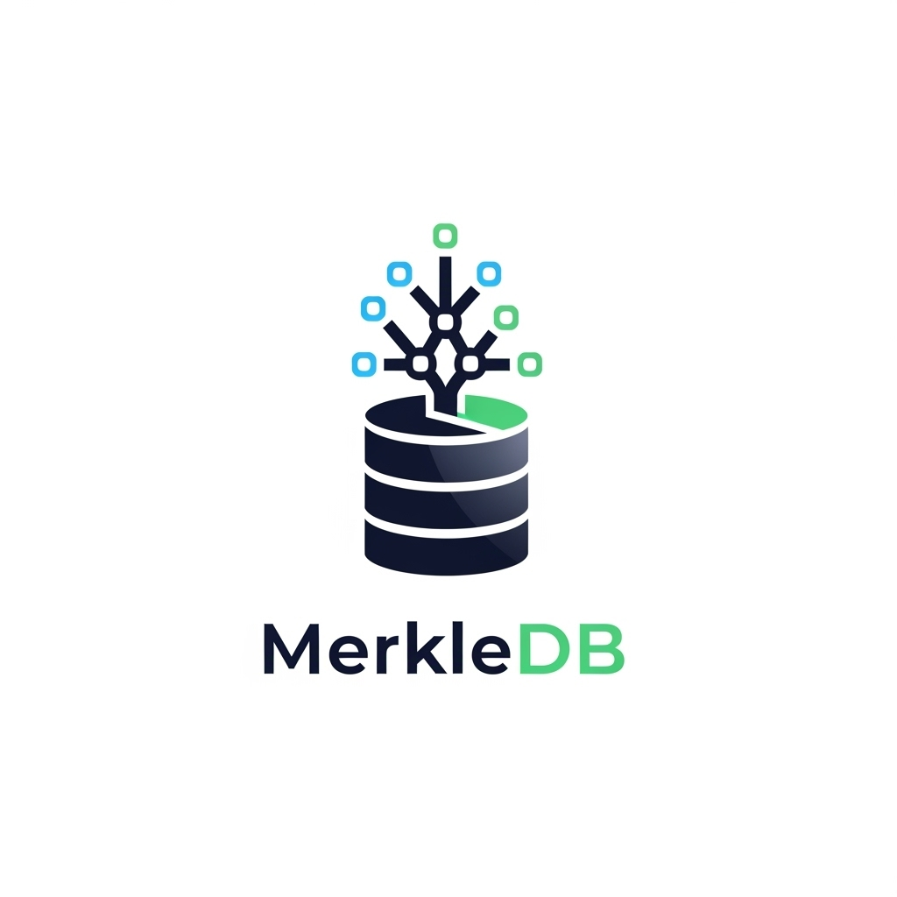

[](https://opensource.org/licenses/MIT)

# MerkleDB

<p align="center">
  
</p>

> **Git-like versioning for your structured data.**

**MerkleDB** is a Go library that provides a content-addressable storage engine with Git-like versioning semantics. Instead of versioning plain text files, MerkleDB allows you to version your application's structured data (structs, records, configurations, etc.) efficiently.

It's built on the same principles as Git, using immutable, content-addressed objects to build a historical graph (DAG) of your data's state over time. This makes it a powerful tool for applications requiring audit trails, configuration history, or reproducible state.

## Key Features

- **🗂️ Git-like Data Model:** Uses `Commit` and `Tree` objects to create snapshots of your data.
- **💾 Efficient Storage:** Content-addressable storage automatically deduplicates unchanged data, saving significant space.
- **⛓️ Immutable History:** Every change is recorded, creating a fully auditable and verifiable history of your dataset.
- **✨ Simple API:** A high-level `Workspace` API abstracts away the low-level details of hashing and tree-building.
- **🔌 Pluggable Backends:** A flexible `Storage` interface allows you to use in-memory, filesystem, or database backends.

## Installation

```sh
go get [github.com/your-username/merkledb](https://github.com/your-username/merkledb)
```
